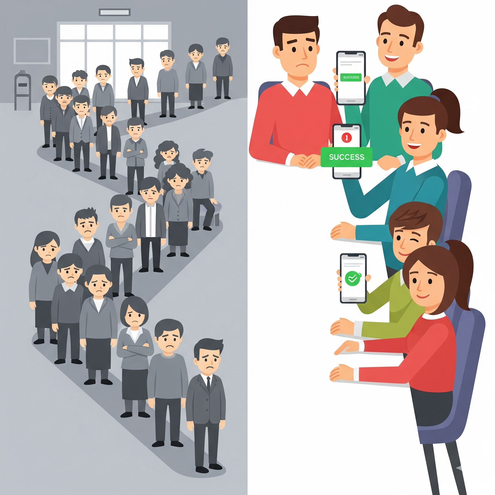

# Qode - Skip the Line 🚀
> **The phone is the queue.** No apps, no registration, just scan and wait.

*Physical waiting vs Digital freedom*

## 📖 About The Project
Qode is a modern, decentralized queue management system designed to democratize waiting. It eliminates the need for expensive hardware kiosks or proprietary apps.

### 🎯 Versatile Deployment Scenarios
* **🌲 Pop-up Events & Festivals:** Print the QR code **once**, stick it on a tree or a wall. No electricity or internet required at the entrance.
* **🍽️ Restaurants & Food Trucks:** Set up a tablet in "Kiosk Mode" facing the customer for a permanent digital queue point.
* **🏥 Clinics & Service:** Replace the "take a paper number" machine with a "scan to join" poster.

## 🛠️ Tech Stack
* **Backend:** Python (FastAPI), Async SQLAlchemy, SQLite (Atomic Locking).
* **Frontend:** React (Vite), Tailwind CSS.
* **Real-Time:** Native WebSockets (Push updates).
* **DevOps:** Docker-ready architecture.

## ⚡ How It Works
1.  **Host creates queue:** The manager starts a session on their phone or laptop.
2.  **Generate QR:** The system produces a unique Entry QR (Printable).
3.  **Guests scan & wait:** Visitors scan the code to grab a digital ticket.
4.  **Real-time Sync:** Guests see their position and ETA update live via WebSockets.
5.  **Verify:** Host scans the guest's ticket to verify entry.

## 🚀 Running Locally
1.  `cd backend && pip install -r requirements.txt && uvicorn main:app --reload`
2.  `cd frontend && npm install && npm run dev -- --host`

## 📋 Features
* ✅ **No App Required:** Pure web-based, works on any device
* ✅ **Atomic Operations:** Race-condition-free ticket assignment (tested with 50 concurrent users)
* ✅ **Real-Time Updates:** WebSocket-powered live position and ETA
* ✅ **QR Code Entry:** Printable entry points for offline deployment
* ✅ **Mobile Pairing:** "Kiosk Mode" allows phones to act as mobile scanners
* ✅ **ETA Calculation:** Smart wait time estimation using Exponential Moving Average
* ✅ **No-Show Handling:** Mark absent guests without advancing the queue

## 🏗️ Architecture
See [ARCHITECTURE.md](ARCHITECTURE.md) for technical details.

## 📝 License
MIT License - feel free to use this for your events!

## 🙏 Acknowledgments
Built with Claude Code - demonstrating the power of AI-assisted development.
